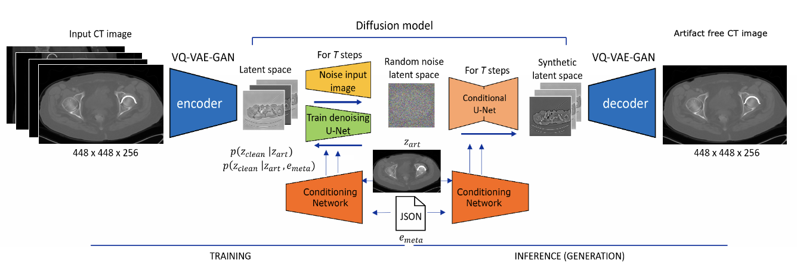
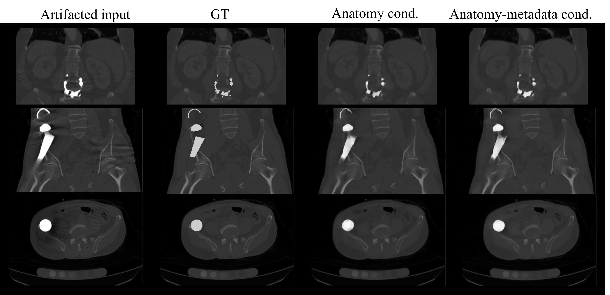
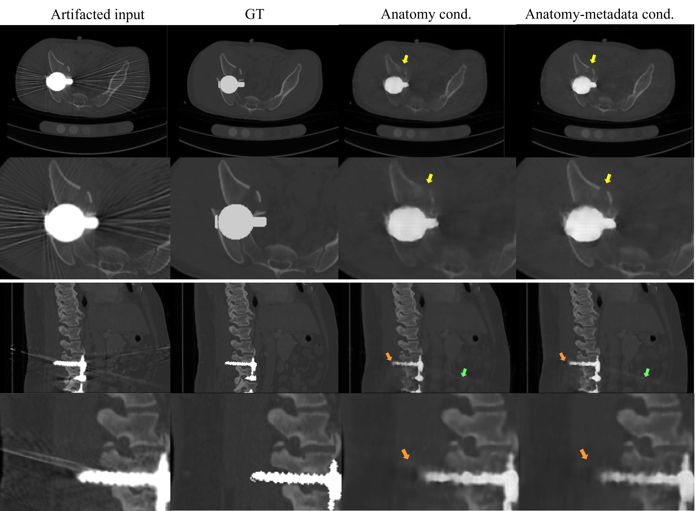
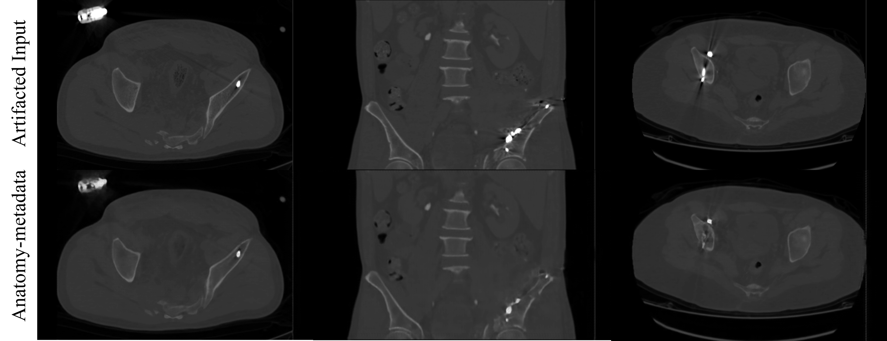

# Large-Volume Conditioned 3D Latent Diffusion Models for CT Metal Artifact Suppression

[](https://github.com/ETRO-MIT/3D-LDMs-for-CT-MAR)
[](LICENSE)
[](https://huggingface.co/xabimoreno/3D-LDMs-for-CT-MAR)

Official repository for **Large-Volume Conditioned 3D Latent Diffusion Models for CT Metal Artifact Suppression** (Presented at DGM4MICCAI, MICCAI 2026 Workshop).

This repository provides an end-to-end framework supporting:
1. **Synthetic Metal Artifact Generation**: A full 3D polychromatic projection and reconstruction simulation pipeline based on ASTRA CUDA, anatomical segmentations, and an anatomy-aware implant library.
2. **CT Metal Artifact Suppression (MAR)**: The first large-volume 3D image-domain latent diffusion framework for CT metal artifact suppression, evaluating two conditioning strategies:
   - **Anatomy-Conditioned LDM**: Conditioned on the artifacted CT image prior via latent channel concatenation.
   - **Anatomy + Metadata-Conditioned LDM**: Conditioned on the artifacted CT prior and cross-attention metadata tokens (anatomical region, implant laterality, and metal material).

⚠️ **Notes:**
- The provided models and pipelines are intended for **research purposes only** and have not been validated for clinical or commercial use.
- 3D CT projection simulation and diffusion inference operate on large volumes (up to $448 \times 448 \times 256$ voxels) and require an **NVIDIA GPU with CUDA acceleration**.

> **Related Sources:**
> - **Paper:** *Large-Volume Conditioned 3D Latent Diffusion Models for CT Metal Artifact Suppression*, DGM4MICCAI 2026 (In press / Preprint).
> - **Pretrained Weights:** Hosted on [Hugging Face](https://huggingface.co/xabimoreno/3D-LDMs-for-CT-MAR).
> - **Organization:** [ETRO - Department of Electronics and Informatics](https://www.etrovub.be/), Vrije Universiteit Brussel (VUB) and [imec](https://www.imec-int.com/).

---

## Citation

If you find this repository or our work useful in your research, please cite:

```bibtex
@inproceedings{casado2026largevolume,
  title={Large-Volume Conditioned 3D Latent Diffusion Models for CT Metal Artifact Suppression},
  author={Moreno Casado, Xabier and Vandemeulebroucke, Jef and Ceranka, Jakub},
  booktitle={Deep Generative Models for Medical Imaging (DGM4MICCAI), MICCAI Workshop},
  year={2026},
  note={In press}
}
```

---

## Introduction & Methodology

Metallic implants in computed tomography (CT), such as hip prostheses, spinal fixation screws, and plates, generate severe streaking, shading, and cupping artifacts due to beam hardening, photon starvation, scatter, and reconstruction nonlinearities. These artifacts obscure critical anatomy and hinder computer-assisted surgery and downstream image computing.

Existing projection-domain and dual-domain methods require access to raw scanner projection data and scanner geometries, which are frequently unavailable in retrospective clinical repositories. To overcome these limitations, we propose the first 3D image-domain latent diffusion framework for large-volume CT metal artifact suppression:

<p align="center">
  
</p>

**Figure 1.** Architecture of the proposed conditional large-volume 3D latent diffusion framework for image-domain MAR. A Stage 1 VQ-VAE-GAN compresses full-resolution 3D CT volumes into compact latent representations. A 3D conditional diffusion U-Net operates on $448 \times 448 \times 256$ voxel crops to denoise the latent space back to clean, artifact-suppressed representations. Both models are conditioned on the artifacted CT; the metadata-conditioned model additionally injects cross-attention implant and anatomy embeddings.

---

## Benchmark Results

### Quantitative Evaluation on Paired Synthetic Test Volumes

On 50 held-out test CT volumes with simulated metal artifacts, both conditional LDMs significantly improve structural fidelity and perceptual metrics over the raw artifacted input:

| Metric | Raw (Artifacted) | Anatomy LDM | Anatomy-Metadata LDM |
| :--- | :---: | :---: | :---: |
| **MAE** &darr; | **0.006 [0.005, 0.007]** | 0.008 [0.008, 0.009]<sup>*</sup> | 0.009 [0.008, 0.009] |
| **RMSE** &darr; | 0.031 [0.028, 0.033] | 0.023 [0.021, 0.024] | **0.021 [0.021, 0.023]**<sup>***</sup> |
| **PSNR [dB]** &uarr; | 36.29 [35.62, 37.20] | 38.89 [38.47, 39.81] | **39.43 [38.94, 39.72]**<sup>***</sup> |
| **SSIM** &uarr; | 0.981 [0.974, 0.985] | 0.991 [0.988, 0.992] | **0.992 [0.991, 0.993]**<sup>***</sup> |
| **LPIPS** &darr; | 0.062 [0.040, 0.081] | 0.037 [0.029, 0.043] | **0.028 [0.025, 0.034]**<sup>***</sup> |
| **Artifact Suppression** &uarr; *(0–5)* | — | **3.543 &plusmn; 1.107**<sup>***</sup> | 3.397 &plusmn; 1.103 |
| **Anatomical Preservation** &uarr; *(0–5)* | — | 3.477 &plusmn; 0.966 | **3.633 &plusmn; 0.988**<sup>***</sup> |
| **Overall Quality** &uarr; *(0–5)* | — | 3.387 &plusmn; 1.007 | **3.433 &plusmn; 0.994** *(n.s.)* |

<sub>Values report median [bootstrap 95% CI]. Reviewer scores are mean &plusmn; standard deviation.<br/>
Superscripts report direct comparison between the two LDMs: <sup>*</sup> <i>p</i> &lt; 0.05, <sup>***</sup> <i>p</i> &lt; 0.001, <i>n.s.</i> not significant after Bonferroni correction.</sub>

### Qualitative Results

<p align="center">
  
</p>

**Figure 2.** Paired synthetic MAR examples. Columns show: (1) Artifacted input CT, (2) Ground-truth clean CT with inserted implant, (3) Anatomy-conditioned output, and (4) Anatomy-and-metadata conditioned output.

<p align="center">
  
</p>

**Figure 3.** Complementary trade-off between conditioning strategies. **Top:** Better anatomical preservation with anatomy-metadata conditioning (yellow arrows). **Bottom:** Residual streaking and shading artifacts around high-density implants (green and orange arrows).

<p align="center">
  
</p>

**Figure 4.** Qualitative inference on real postoperative patient CTs from the CLINIC-metal dataset. Each column compares the original artifacted CT slice (top) with the restored output from the metadata-conditioned LDM (bottom).

---

## Quick Start

### Supported Tasks & Models

| Task | Method / Model | Keyword | Description |
| :--- | :--- | :--- | :--- |
| **1. Simulation** | Polychromatic ASTRA 3D | `generate` | Full 3D cone-beam projection & reconstruction metal artifact simulation |
| **2.1. Suppression** | Anatomy-Conditioned 3D LDM | `anatomy` | 3D latent diffusion conditioned on artifacted image prior |
| **2.2. Suppression** | Anatomy + Metadata 3D LDM | `anatomy_metadata` | 3D latent diffusion conditioned on artifacted prior + implant metadata |

### Quick Example

```bash
# Clone repository
git clone https://github.com/ETRO-MIT/3D-LDMs-for-CT-MAR.git
cd 3D-LDMs-for-CT-MAR

# Create virtual environment and install dependencies
python3.11 -m venv .venv
source .venv/bin/activate
pip install --upgrade pip setuptools wheel
pip install -e ".[all]"

# Download pretrained model weights
python DownloadWeights.py

# Run Anatomy-Conditioned MAR
python Main.py suppress --input sample_artifacted.nii.gz --output_dir outputs/restored --model anatomy

# Run Anatomy + Metadata-Conditioned MAR
python Main.py suppress --input sample_artifacted.nii.gz --output_dir outputs/restored \
  --model anatomy_metadata --region hip --side right --metal titanium
```

---

## Installation

### Requirements
- **OS:** Linux (recommended) or macOS (local CPU check only).
- **Python:** 3.11.
- **Hardware:** NVIDIA GPU with $\ge 24$ GB VRAM recommended for full $448 \times 448 \times 256$ diffusion inference; CUDA-enabled ASTRA toolbox required for 3D simulation.

### Setup Instructions

```bash
# 1. Create and activate environment

# Option A: Conda (Recommended for GPU clusters / HPC)
conda create -n ct-mar python=3.11 -y
conda activate ct-mar

# Option B: Python venv
python3 -m venv .venv
source .venv/bin/activate

# 2. Install package and dependencies
# For artifact suppression only:
pip install -e ".[inference]"

# For synthetic generation and implant tools:
pip install -e ".[synthesis,implant-tools]"

# Or install all extras (includes TotalSegmentator, MONAI, and training tools):
pip install -e ".[all]"

# 3. (Optional for Task 1 GPU simulation) Install CUDA-enabled ASTRA Toolbox:
conda install -c astra-toolbox -c conda-forge astra-toolbox -y
```

Verify the installation:
```bash
python -c "import ct_mar; print('ct-mar version:', ct_mar.__version__)"
```

### Pretrained Model Weights

Download the pretrained model checkpoints before running artifact suppression:

```bash
# Download all models into checkpoints/
python DownloadWeights.py

# Or via Main.py:
python Main.py download
```

To download individual checkpoints or specify custom directories, see [checkpoints/README.md](checkpoints/README.md).

---

## Repository Structure

```text
3D-LDMs-for-CT-MAR/
├── Figures/                     # Paper figures and illustrations
│   ├── Architecture_model.png   # Model architecture overview (Figure 1)
│   ├── Figure_2.png             # Paired synthetic test comparisons (Figure 2)
│   ├── Figure_3.png             # Visual review trade-off analysis (Figure 3)
│   └── Figure_4.png             # Qualitative evaluation on real clinical CTs (Figure 4)
├── checkpoints/                 # Pretrained model weights
│   └── README.md                # Checkpoint descriptions and download instructions
├── configs/
│   ├── inference/               # Model inference configurations
│   │   ├── vqvae_ds4.yaml       # Shared Stage 1 VQ-VAE model architecture
│   │   ├── anatomy_ldm.yaml     # Anatomy-conditioned LDM configuration
│   │   └── anatomy_metadata_ldm.yaml # Anatomy + Metadata-conditioned LDM configuration
│   └── training/                # Training configurations
│       ├── vqvae_ds4_train.yaml # Stage 1 VQ-VAE-GAN training hyperparameters
│       ├── anatomy_ldm_train.yaml # Anatomy-conditioned LDM training hyperparameters
│       └── anatomy_metadata_ldm_train.yaml # Anatomy + Metadata LDM training hyperparameters
├── data/
│   └── implant_library/         # Sample implants (e.g. hip prostheses)
├── docs/                        # Detailed technical documentation
│   ├── synthetic_generation.md  # Complete 3D simulation workflow guide
│   ├── ct_preprocessing.md      # CT spacing and orientation specifications
│   └── implant_library.md       # STL and CT implant library construction
├── src/
│   └── ct_mar/
│       ├── __init__.py
│       ├── synthesis/           # Task 1: Synthetic artifact generation pipeline
│       │   ├── generate.py      # Simulation driver (ct-mar-generate)
│       │   ├── simulation.py    # Polychromatic projection and reconstruction
│       │   ├── geometry_astra.py# ASTRA CUDA projector configuration
│       │   └── preprocessing/   # Anatomy segmentation and implant placement
│       ├── inference/           # Task 2: Metal artifact suppression pipeline
│       │   ├── pipeline.py      # High-level MARPipeline orchestrator
│       │   ├── inferer.py       # LatentDiffusionInferer reverse sampling loop
│       │   ├── transforms.py    # CT windowing [-1000, 4000], normalization, 3D padding/crop
│       │   ├── io.py            # NIfTI affine-preserving save & slice preview export
│       │   ├── cli.py           # CLI entry point (ct-mar-suppress)
│       │   └── models/          # Neural network architectures
│       │       ├── vqvae.py     # Stage 1 3D VQ-VAE
│       │       ├── diffusion_unet.py # Stage 2 3D Diffusion UNet denoiser
│       │       ├── metadata.py  # Categorical metadata encoder
│       │       └── schedulers.py# DDPM scheduler with cosine schedule and v-prediction
│       └── training/            # Model training pipelines
│           ├── dataset.py       # Paired 3D MAR dataset loader with on-the-fly augmentation
│           ├── discriminator.py # 3D patch discriminator for Stage 1 adversarial training
│           ├── train_vqgan.py   # Stage 1 VQ-VAE-GAN training script
│           └── train_ldm.py     # Stage 2 3D Latent Diffusion Model training script
├── tests/                       # Unit tests
│   ├── test_synthesis.py
│   ├── test_preprocessing.py
│   └── test_inference.py
├── DownloadWeights.py           # Pretrained checkpoint downloader from Hugging Face
├── Main.py                      # Unified top-level execution entry point
├── pyproject.toml               # Package specifications and entry points
├── THIRD_PARTY_NOTICES.md       # Upstream MedLoRD and MONAI notices
└── LICENSE                      # Apache-2.0 open-source license
```

---

## Implementation & Usage Guide

### Task 1: Synthetic Metal Artifact Generation

Simulate realistic 3D metal artifacts on a clean CT volume using ASTRA CUDA projection and FDK reconstruction:

```bash
# 1. All-in-One (Recommended): On-the-fly anatomy segmentation, implant selection, and simulation
python Main.py generate \
  --input /path/to/clean_ct.nii.gz \
  --output_dir outputs/synthetic_case \
  --metal titanium

# 2. Or using existing TotalSegmentator masks (skips re-segmentation):
python Main.py generate \
  --input /path/to/clean_ct.nii.gz \
  --anatomy_dir /path/to/totalseg_masks \
  --output_dir outputs/synthetic_case \
  --metal titanium

# 3. Or using a custom pre-aligned implant mask:
python Main.py generate \
  --input /path/to/clean_ct.nii.gz \
  --implant_mask /path/to/implant_mask.nii.gz \
  --output_dir outputs/synthetic_case \
  --metal titanium
```

> [!NOTE]
> In **All-in-One mode** (Option 1), TotalSegmentator runs automatically in a temporary directory, detects the anatomical region (Hip vs Spine), randomly selects an implant from `data/implant_library/`, and determines the 3D position that maximizes bone overlap. Intermediate segmentation files are automatically deleted after simulation to save disk space (use `--keep_anatomy` to retain them).

Or run directly via the installed CLI:
```bash
ct-mar-generate \
  --image /path/to/clean_ct.nii.gz \
  --output-dir outputs/synthetic_case
```

**Outputs generated:**
For an input CT `case_001.nii.gz`:
1. `synth_case_001.nii.gz`: Synthesized CT volume with realistic metal artifacts.
2. `implant_only_case_001.nii.gz`: Paired ground-truth CT with clean implant insertion (target for training).
3. `synth_case_001_metal_mask.nii.gz`: Binary mask of the inserted metal implant.
4. `synth_case_001.json`: Simulation parameters, selected implant ID, region, and metadata.

> [!TIP]
> The default simulation geometry matches the Master's Thesis: 360 projection angles, $256 \times 256$ detector grid, $\text{SOD}=30\text{ cm}$, $\text{SDD}=60\text{ cm}$, and `detector_spacing = 0.5 cm` ($64\text{ cm}$ field-of-view at isocenter to prevent anatomical truncation). These can be customized via `--detector_spacing`, `--detector_pixels`, `--angle_num`, etc.

---

### Task 2: Metal Artifact Suppression (Inference)

To restore an artifact-corrupted CT volume using pretrained models:

#### Anatomy-Conditioned LDM (`anatomy`)
```bash
python Main.py suppress \
  --input /path/to/artifacted_ct.nii.gz \
  --output_dir outputs/restored \
  --model anatomy \
  --steps 500
```

#### Anatomy + Metadata-Conditioned LDM (`anatomy_metadata`)
```bash
python Main.py suppress \
  --input /path/to/artifacted_ct.nii.gz \
  --output_dir outputs/restored \
  --model anatomy_metadata \
  --region hip \
  --side right \
  --metal titanium \
  --steps 500
```

You can also provide the sidecar metadata JSON file directly:
```bash
python Main.py suppress \
  --input /path/to/artifacted_ct.nii.gz \
  --metadata_json /path/to/artifacted_ct.json \
  --output_dir outputs/restored \
  --model anatomy_metadata
```

Or use the CLI command:
```bash
ct-mar-suppress --input artifacted.nii.gz --output-dir outputs/restored --model anatomy
```

**Outputs generated:**
1. `*_restored_{model}.nii.gz`: Restored CT volume in original Hounsfield Units, preserving the original NIfTI geometry and affine coordinates.
2. `*_preview_{model}.png`: Side-by-side axial slice comparison between the input artifacted CT and the restored result.

---

### Model Training Pipeline

To train your own models from scratch or fine-tune on custom cohorts:

#### 1. Stage 1: VQ-VAE-GAN Training
Train the 3D discrete autoencoder on clean, artifact-free 3D CT volumes:

```bash
ct-mar-train-vqgan \
  --config_file configs/training/vqvae_ds4_train.yaml \
  --train_ids /path/to/clean_cts_manifest.csv \
  --output_dir runs/vqgan \
  --batch_size 8 \
  --n_epochs 222
```

#### 2. Stage 2: 3D Latent Diffusion Model Training
Train the conditional 3D diffusion U-Net using paired synthetic data:

```bash
# Train Anatomy-Conditioned LDM
ct-mar-train-ldm \
  --model anatomy \
  --config_file configs/training/anatomy_ldm_train.yaml \
  --config_vqvae configs/training/vqvae_ds4_train.yaml \
  --vqvae_ckpt runs/vqgan/checkpoint_best.pth \
  --train_ids /path/to/paired_train.csv \
  --output_dir runs/ldm_anatomy

# Train Anatomy + Metadata-Conditioned LDM
ct-mar-train-ldm \
  --model anatomy_metadata \
  --config_file configs/training/anatomy_metadata_ldm_train.yaml \
  --config_vqvae configs/training/vqvae_ds4_train.yaml \
  --vqvae_ckpt runs/vqgan/checkpoint_best.pth \
  --train_ids /path/to/paired_train.csv \
  --output_dir runs/ldm_metadata
```

---

### Python API Integration

You can also integrate the models directly into Python workflows:

```python
from ct_mar.inference import MARPipeline

# Initialize pipeline (loads Anatomy + Metadata model)
pipeline = MARPipeline.from_pretrained(
    model_type="anatomy_metadata",
    checkpoint_dir="checkpoints",
    config_dir="configs/inference",
)

# Run artifact suppression
restored_path = pipeline.suppress(
    image_path="sample_artifacted.nii.gz",
    output_dir="outputs/restored",
    region="hip",
    side="left",
    metal_name="titanium",
    num_inference_steps=500,
)
print("Saved restored volume to:", restored_path)
```

---

## License & Attribution

- **Code:** Licensed under the [Apache License 2.0](LICENSE).
- **Pretrained Weights:** Intended for research and academic evaluation under [Creative Commons Attribution Non-Commercial Share-Alike 4.0](https://creativecommons.org/licenses/by-nc-sa/4.0/).
- **Third-Party Acknowledgments:** Architecture components adapt code from [MedLoRD](https://arxiv.org/abs/2503.13211) and [MONAI Consortium](https://monai.io/). See [THIRD_PARTY_NOTICES.md](THIRD_PARTY_NOTICES.md) for full notices.
